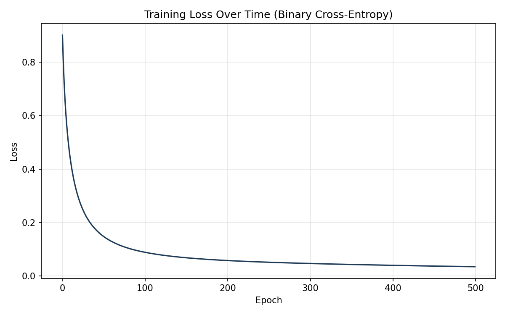

# Artificial Neural Network — Built from Scratch

A multilayer perceptron (MLP) implemented entirely with NumPy — no
`sklearn.neural_network`, no PyTorch, no TensorFlow. Every part of the
forward pass, backpropagation, and gradient descent weight update is
written by hand, so you understand and can explain exactly what the model
is doing at each step.

## What it does

Predicts whether a breast tumour is **malignant** or **benign** from 30
numeric measurements (radius, texture, perimeter, smoothness, etc.), using
the classic **Breast Cancer Wisconsin (Diagnostic)** dataset (569 samples,
loaded via scikit-learn — no manual download needed).

This is a real binary classification task with genuine business framing:
false negatives (missing a malignant tumour) are far more costly than false
positives, which is why the code reports precision, recall and F1 — not
just accuracy — since accuracy alone can hide a model that's dangerously
weak on the minority/critical class.

## Architecture
- **ReLU** in the hidden layers — avoids the vanishing-gradient problem that
  sigmoid/tanh have in deeper networks.
- **Sigmoid** on the output — squashes the result to a 0–1 probability,
  appropriate for binary classification.
- **He initialisation** for the weights — scales the initial random weights
  based on layer size, which keeps signal variance stable as it passes
  through multiple layers (a naive small-random init tends to vanish).

## How training works (the part that matters most)

1. **Forward pass** — input data flows through each layer: multiply by
   weights, add bias, apply the activation function. Every intermediate
   value is cached because backpropagation needs it.
2. **Loss calculation** — **binary cross-entropy**, the standard loss
   function for binary classification, measuring how far the predicted
   probability is from the true 0/1 label.
3. **Backpropagation** — the error at the output is propagated backwards
   through the network, layer by layer, using the chain rule to work out
   how much each individual weight contributed to that error.
4. **Gradient descent** — every weight is nudged slightly in the direction
   that reduces the error, scaled by the learning rate.
5. Repeat for 500 epochs, tracking the loss each time.

## Data handling

- Split 80/20 into train/test sets, **stratified** so both sets keep the
  same proportion of malignant/benign cases.
- Features are **standardised** (mean 0, standard deviation 1) — the scaler
  is fit only on the training data and then applied to the test data, to
  avoid leaking test-set information into training (a common real-world
  mistake).

## Results

On a held-out test set the model achieves:

| Metric | Score |
|---|---|
| Accuracy | ~97% |
| Precision | ~99% |
| Recall | ~97% |
| F1 score | ~98% |

(Exact numbers vary slightly by random seed — see console output when you
run it.)

### Training Loss Convergence

[cite: 1]

## Files

- `neural_network.py` — the full implementation: activation functions,
  the `NeuralNetwork` class (forward pass, backprop, training loop), data
  loading/preprocessing, and evaluation. Run this file directly to train
  and see results.
- `plot_loss.py` — generates `loss_curve.png`, a chart of training loss
  over time, showing the network converging[cite: 1].
- `loss_history.csv` — raw loss values per epoch, generated after running
  `neural_network.py`.

## How to run it

```bash
pip install numpy scikit-learn matplotlib
python neural_network.py     # trains the model, prints results, saves loss_history.csv
python plot_loss.py          # generates loss_curve.png from that history
